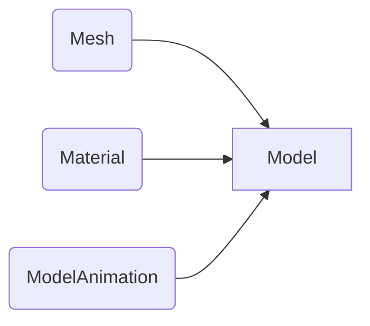

# Mesh
```c
struct Mesh; // Mesh, vertex data and vao/vbo
```
The Mesh struct is the one of the components of a Model (along with materials and animation data) for use in 3D rendering.

It is essentially a series of Arrays, also known in this context as Vertex Buffer Objects (VBOs) when uploaded to the GPU
> Written with [StackEdit](https://stackedit.io/).
